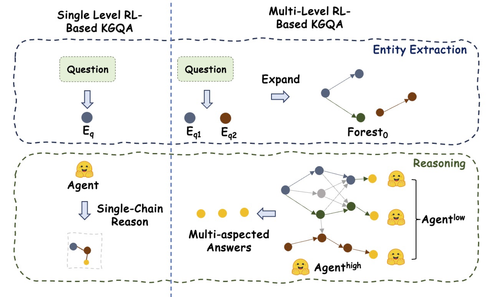

Welcome! I’m **Yongkang Zhou**, a second-year M.S. student in Computer Technology at East China Normal University (ECNU), advised by Prof. Junjie Yao. 

My current research focuses on building reliable and efficient **Large Language Model** systems, with a particular emphasis on **Retrieval-Augmented Generation**
and **Information Retrieval**. I am also open to broader directions where LLMs can be applied responsibly and effectively for societal benefit

📰News
------
- 📄 **Jun 2025** — *GEAR: Graph-Efficient Augmented Retrieval* submitted to **ICDE 2026**
- 🎤 **May 2025** — Presented **ProRAG** at **DASFAA 2025 (Oral Presentation)** in Singapore
- 🎉 **Jan 2025** — Paper **ProRAG: Towards Reliable and Proficient AIGC-based Digital Avatar** accepted at **DASFAA 2025**

Publicatin
------

  

    
  

  

    

      
International Conference on Database Systems for Advanced Applications (DASFAA 2025)

      
<strong>ProRAG: Towards Reliable and Proficient AIGC-based Digital Avatar</strong>

      
<strong>Zhou, Y.</strong>, Yan, M., Xu, G., Yao, J.

      
Proposed ProRAG, a RAG framework with hierarchical retrieval and multimodal grounding for reliable digital avatar

    

    

      📑 <a href="../assets/dasfaa25_pw.pdf" target="_blank">PDF</a> &nbsp;&nbsp;
    

  

Under Review
------

  

    
  

  

    

      
IEEE International Conference on Data Engineering (ICDE 2026)

      
<strong>GEAR: Graph-efficient Augmented Retrieval via Adaptive Knowledge-path Fusion</strong>

      
<strong>Zhou, Y.</strong>, Quan, X., Hou, Y., Xu, G., Wang, J., Yao, J.

      
Developed GEAR, a multi-head graph retrieval framework that improves accuracy and efficiency by fusing diverse pattern spaces and subgraph structures

    

    

      📑 <a href="../assets/ICDE2026_pw.pdf" target="_blank">PDF</a> &nbsp;&nbsp;
      🛠️ <a href="https://github.com/gabbyzyk/GEAR" target="_blank">Code</a>
    

  

  

    
  

  

    

      
ACM International Conference on Information and Knowledge Management (CIKM 2025)

      
<strong>ThoughtForest-KGQA: A Multi-chain Tree Search for Knowledge Graph Reasoning</strong>

      
Quan, X., <strong>Zhou, Y.</strong>, Yao, J.

      
Developed ThoughtForest-KGQA, a hierarchical reinforcement learning framework using multi-chain tree search for multi-hop question answering over knowledge graphs

    

    

      📑 <a href="../assets/CIKM2025 _pw.pdf.pdf" target="_blank">PDF</a>
    

  

Here is my [Curriculum Vitae](../assets/Curriculum_Vitae.pdf).
